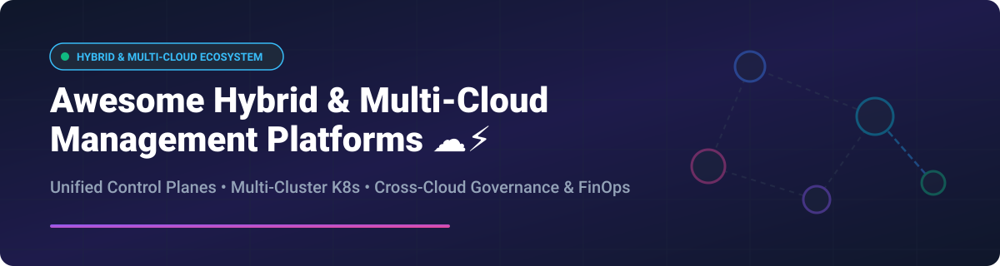

  

# ☁️ Awesome Hybrid & Multi-Cloud Management 🚀

    

> A curated list of top **SaaS platforms**, enterprise control planes, and **open-source GitHub projects** for **Hybrid & Multi-Cloud Management**, Kubernetes multi-cluster orchestration, cloud governance, cross-cloud FinOps, and infrastructure automation.

---

## 📚 Table of Contents
- [🌐 SaaS / Hosted Platforms](#-saas--hosted-platforms)
  - [Market Analysis & Industry Size](#-market-analysis--industry-size)
  - [SaaS Products Comparison](#-saas-products-comparison)
- [⚡ Open-Source GitHub Projects](#-open-source-github-projects)
- [🤝 How to Contribute](#-how-to-contribute)
- [☕ Support & Sponsorship](#-support--sponsorship)
- [📈 Star History](#-star-history)
- [⚠️ Disclaimer](#%EF%B8%8F-disclaimer)

---

## 🌐 SaaS / Hosted Platforms

### 📊 Market Analysis & Industry Size
The global Hybrid and Multi-Cloud Management market size is estimated at **$16.8 Billion USD in 2026** (projected to reach **$42.5 Billion by 2030** at a CAGR of 26.1%). The sector is **moderately fragmented**, led by public cloud hyperscalers (Microsoft Azure, Google Cloud, AWS) and legacy IT giants (VMware Broadcom, Red Hat IBM, Nutanix), alongside hyper-focused SaaS innovators in orchestration and FinOps.

### 🏢 SaaS Products Comparison

*Sorted by Company Size / Valuation / Annual Revenue (Descending)*

| SaaS Product 🛠️ | Description 📝 | Company Revenue / Valuation 🏢 | Starting Tier Pricing 💵 | Free Tier / Trial Limit 🎁 |
| :--- | :--- | :--- | :--- | :--- |
| **[Microsoft Azure Arc](https://azure.microsoft.com/products/azure-arc/)** | Hybrid control plane extending Azure governance, security, and services to any server or Kubernetes cluster. | **~$245 Billion Revenue** (Microsoft Cloud ecosystem) | \$0.12 / vCPU-hour (for Azure Arc-enabled Kubernetes app services) | **Free forever** for control plane management & Azure Policy on Arc-enabled servers |
| **[Google Cloud Anthos / GKE Enterprise](https://cloud.google.com/anthos)** | Google's enterprise multi-cloud Kubernetes platform for container lifecycle, security, and service mesh. | **~$100+ Billion Revenue** (Google Cloud division) | \$24 / vCPU / month (pay-as-you-go subscription) | **\$300 free credits** (90-day Google Cloud free trial) |
| **[AWS Systems Manager](https://aws.amazon.com/systems-manager/)** | Centralized operational node management, patching, inventory, and automation across EC2 & hybrid servers. | **~$105 Billion Revenue** (AWS cloud business segment) | \$0.005 / instance-hour (on-premise / hybrid instance management) | **Free tier** includes 1,000 hybrid instances / month for basic management |
| **[VMware Tanzu Mission Control](https://tanzu.vmware.com/mission-control)** | Unified multi-cluster Kubernetes management across vSphere, public clouds, and edge. | **~$50+ Billion Enterprise Valuation** (VMware Broadcom Business Unit) | \$85 / vCPU / year (Tanzu Advanced Edition licensing) | **30-Day Free Trial** with full multi-cluster management access |
| **[Red Hat Advanced Cluster Management (ACM)](https://www.redhat.com/en/technologies/management/advanced-cluster-management)** | Multi-cluster Kubernetes policy enforcement, governance, and GitOps for OpenShift & hybrid clouds. | **~$5.5 Billion Revenue** (Red Hat IBM Segment) | \$1,200 / Managed Cluster / year (Subscription add-on) | **60-Day Self-Supported Evaluation Trial** |
| **[Nutanix Cloud Manager](https://www.nutanix.com/products/cloud-manager)** | Multi-cloud Intelligent Operations, cost governance, self-service provisioning, and automated orchestration. | **~$2.1 Billion Annual Revenue** | \$180 / core / year (Pro License tier) | **30-Day Hosted Test Drive Trial** |
| **[Rancher Enterprise (SUSE)](https://www.rancher.com/)** | Commercial enterprise Kubernetes platform providing support, hardening, and governance on Rancher core. | **~$650 Million Annual Revenue** (SUSE Group) | \$1,000 / node / year (Enterprise Commercial Support) | **Free Forever** for core open-source Rancher edition |
| **[Morpheus Data](https://morpheusdata.com/)** | Agnostic hybrid cloud management platform (CMP) for provisioning, orchestration, FinOps, and IT governance. | **~$100 Million Valuation** | \$150 / managed workload / year | **45-Day Full-Featured Enterprise Trial** |
| **[CloudBolt](https://www.cloudbolt.io/)** | FinOps-driven hybrid cloud management, self-service IT provisioning, and cost optimization. | **~$50 Million Valuation** | \$12 / resource / month | **30-Day Free Trial** (up to 100 managed VMs) |
| **[Scalr](https://scalr.com/)** | Multi-cloud IaC management platform with policy-as-code, cost estimation, and state management. | **~$20 Million Valuation** | \$0.99 / run-hour (after free tier) | **Free Forever** for up to 500 environment runs / month |

---

## ⚡ Open-Source GitHub Projects

*Sorted by GitHub Stars_Count (Descending)*

| Project 📦 | GitHub_Stars ⭐ | Description 📝 |
| :--- | :--- | :--- |
| **[HashiCorp Terraform](https://github.com/hashicorp/terraform)** |  | Universal Infrastructure-as-Code (IaC) tool to provision and manage multi-cloud resources. |
| **[Argo CD](https://github.com/argoproj/argo-cd)** |  | Declarative GitOps continuous delivery tool for multi-cluster Kubernetes environments. |
| **[Rancher](https://github.com/rancher/rancher)** |  | Complete open-source container management platform for multi-cluster Kubernetes. |
| **[Crossplane](https://github.com/crossplane/crossplane)** |  | Cloud-native control plane framework extending Kubernetes API to manage any cloud infrastructure. |
| **[Flux CD](https://github.com/fluxcd/flux2)** |  | Open and extensible set of continuous and progressive delivery solutions for Kubernetes fleets. |
| **[Open Policy Agent (OPA)](https://github.com/open-policy-agent/opa)** |  | General-purpose policy engine for unified policy enforcement across multi-cloud stacks. |
| **[Cluster API](https://github.com/kubernetes-sigs/cluster-api)** |  | Kubernetes sub-project bringing declarative, K8s-style APIs to cluster creation & management. |
| **[Karmada](https://github.com/karmada-io/karmada)** |  | Kubernetes management system enabling multi-cloud and multi-cluster application management. |
| **[Open Cluster Management (OCM)](https://github.com/open-cluster-management-io/ocm)** |  | Modular multi-cluster management control plane backing Red Hat ACM. |
| **[KubeSlice](https://github.com/kubeslice/kubeslice)** |  | Creates application-centric virtual clusters across multi-tenant, hybrid, and multi-cloud infrastructure. |

---

## 🤝 How to Contribute

Contributions are highly appreciated! To contribute:

1. 🍴 **Fork** the repository.
2. 🌿 **Create** a new feature branch (`git checkout -b add-new-platform`).
3. 📝 **Add** your item with clear description, pricing details, or GitHub links.
4. 🚀 **Commit & Push** your changes (`git commit -m 'Add new multi-cloud tool'`).
5. 📬 **Open a Pull Request**!

---

## ☕ Support & Sponsorship

If you found this curated list helpful, please consider showing your support:

- ⭐ **Star** this repository to help others discover it!
- 🔀 **Fork** and contribute to keep the list updated.
- 📢 **Share** with your DevOps, Platform Engineering, and Cloud Architecture teams.
- 💖 **Sponsor**: Buy me a coffee and support open-source curation on [GitHub Sponsors](https://github.com/sponsors/ishandutta2007).

---

## 📈 Star History

---

## ⚠️ Disclaimer

This repository is community-curated for informational and educational purposes. Brand names, logos, and trademarks belong to their respective owners. Hybrid/multi-cloud architecture design requires careful evaluation of security, network connectivity, and compliance considerations.
